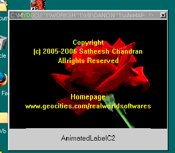



## Animated Label Activex Control 1\.0 Style C

### Description

See Screen Shot.This control displays Scrolling texts like Credit display on TV Screens. Make your program more attractive with animated labels. It works similar to a standard label control in VB, but also have some additional animated features. Every programmers want it. Make your Credits dialog boxes more attractive with this scrolling label, No more coding is required.

You can use scripts like

&lt;F.BOLD&gt;,&lt;F.ITALIC&gt;,&lt;F.STRIKETHROUGH&gt;,&lt;F.UNDERLINE&gt;

&lt;F.WGHT:,&lt;F.SIZEX:,&lt;F.CAHRS:,&lt;F.COLOR:,&lt;F.NAMEX: &lt;eg:&lt;F.COLOR:&H000000FF&gt; on the caption.

You can also load information from file.
 
### More Info
 

             |
---                |---
**Submitted On**   |2005-07-15 21:02:38
**By**             |[Satheesh Chandran](https://github.com/Planet-Source-Code/PSCIndex/blob/master/ByAuthor/satheesh-chandran.md)
**Level**          |Intermediate
**User Rating**    |5.0 (15 globes from 3 users)
**Compatibility**  |VB 4\.0 \(32\-bit\), VB 5\.0, VB 6\.0
**Category**       |[Libraries](https://github.com/Planet-Source-Code/PSCIndex/blob/master/ByCategory/libraries__1-49.md)
**World**          |[Visual Basic](https://github.com/Planet-Source-Code/PSCIndex/blob/master/ByWorld/visual-basic.md)
**Archive File**   |[Animated\_L1913627152005\.zip](https://github.com/Planet-Source-Code/satheesh-chandran-animated-label-activex-control-1-0-style-c__1-61714/archive/master.zip)

